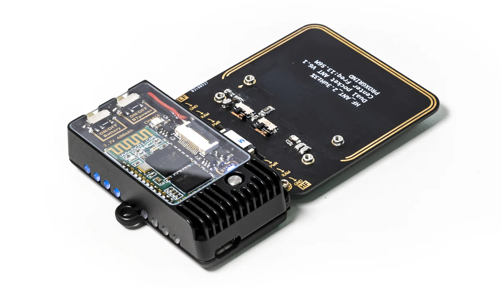

# RFID Key Cloning (Clonage de clés RFID)

Le **RFID Key Cloning** est une technique qui permet de copier les informations contenues dans un badge ou une carte RFID (Radio Frequency Identification) pour créer un double. Cette méthode est souvent utilisée dans des tests de sécurité pour démontrer les vulnérabilités des systèmes d'accès basés sur les badges sans contact.

> [!CAUTION]  
> ⚠️ **Avertissement :**  
> Les informations fournies ici sont à des fins éducatives uniquement. Toute utilisation illégale de ces techniques est strictement interdite. Utilisez ces techniques uniquement dans le cadre de tests de sécurité avec l'autorisation des propriétaires.

---

## Principe du clonage RFID

Les systèmes **RFID** utilisent des badges ou des cartes qui émettent des signaux contenant des données d'authentification (comme un identifiant unique). Ces informations sont transmises via des ondes radio à un lecteur qui vérifie l'accès. Le **clonage RFID** consiste à capter ces informations à l'aide d'un lecteur RFID et à les copier sur une nouvelle carte.

1. **Lecture des informations** : L'attaquant utilise un lecteur RFID pour intercepter les informations émises par la carte ou le badge.
2. **Clonage des données** : Une fois les données capturées, elles sont copiées sur une carte vierge ou un autre support RFID.
3. **Utilisation du clone** : Le badge cloné peut alors être utilisé pour accéder aux systèmes sécurisés, tout comme l'original.

---

## Outils utilisés pour le clonage RFID

1. **Proxmark3**
   - C'est l'un des outils les plus populaires pour cloner des badges RFID. Il permet de lire, d'enregistrer et de réécrire des données RFID sur des cartes vierges.
   - **Fonctionnalités** : Compatible avec une large gamme de fréquences (125 kHz et 13,56 MHz), il peut lire et écrire sur des cartes **LF** et **HF**.
   - 

2. **Lecteurs RFID portables**
   - Des dispositifs portables comme le **ChameleonMini** peuvent capturer des données RFID à partir de cartes sans contact.
   - **Exemple** : Un **lecteur RFID portable** peut facilement capturer les données d'un badge RFID dans un environnement physique où les utilisateurs passent avec leurs badges.

3. **Cartes vierges RFID**
   - Après avoir capturé les données, il est nécessaire d'écrire ces informations sur une carte RFID vierge pour créer un double fonctionnel.
   - **Exemple** : Des cartes vierges compatibles avec les formats **LF (Low Frequency)** ou **HF (High Frequency)** sont couramment utilisées.

---

## Exemples de Scénarios

1. **Accès à un bâtiment d'entreprise** : Un attaquant peut capter le signal d'un badge RFID d'un employé à proximité (par exemple, dans un hall d'entrée), cloner les informations, puis utiliser la carte clonée pour entrer dans des zones sécurisées.
   
2. **Clonage d'une carte de contrôle d'accès** : Dans certains environnements sécurisés, les cartes RFID sont utilisées pour accéder à des salles serveurs ou des laboratoires. En clonant ces cartes, l'attaquant peut accéder à des zones où l'accès est restreint.

---

## Comment protéger contre le clonage RFID

1. **Utilisation de cartes RFID chiffrées** : Certaines cartes RFID utilisent des mécanismes de chiffrement pour sécuriser les données transmises.
2. **Blocs RFID** : Des étuis ou des pochettes RFID peuvent empêcher la capture des données de la carte en bloquant les signaux RFID.
3. **Authentification multifactorielle** : En complément des cartes RFID, il est recommandé d'ajouter des couches de sécurité, comme des codes PIN ou la biométrie, pour renforcer la sécurité.

---

## Conclusion

Le **RFID Key Cloning** met en lumière la vulnérabilité des systèmes d'accès basés sur des cartes sans contact, surtout lorsqu'ils ne sont pas protégés par des mécanismes de sécurité supplémentaires. Il est important de sécuriser les environnements sensibles avec des cartes RFID chiffrées et des protections contre le clonage.

> **Remarque** : Utilisez toujours ces techniques de manière légale et avec l'autorisation des propriétaires des systèmes.
