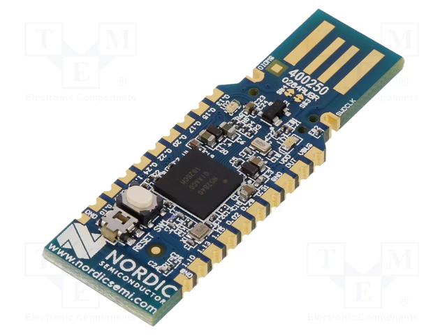

# Bluetooth Relay Attack

Bienvenue dans la section **Bluetooth Relay Attack**. Cette attaque cible les systèmes utilisant l'authentification par proximité Bluetooth, comme les voitures sans clé ou les serrures intelligentes. L'objectif d'une attaque par relais est de tromper le dispositif cible en lui faisant croire que le périphérique légitime (comme une clé ou un smartphone) est à proximité, même s'il se trouve à distance.

> [!CAUTION]  
> ⚠️ **Avertissement :**  
> Les informations présentées ici sont à des fins éducatives uniquement. L'utilisation malveillante de ces techniques est strictement interdite. Toute expérimentation doit se faire dans un cadre légal, avec l'autorisation des propriétaires des systèmes ciblés.

---

## Présentation de l'attaque par relais Bluetooth

### Qu'est-ce qu'une attaque par relais Bluetooth ?

Une **attaque par relais Bluetooth** consiste à capter le signal Bluetooth émis par un appareil (par exemple, une clé de voiture) et à le retransmettre à un autre appareil situé à proximité du dispositif cible (comme la voiture elle-même). Cette technique permet de déverrouiller ou de démarrer un véhicule sans que la clé soit physiquement à proximité.

### Exemple avec une voiture sans clé

Prenons l'exemple d'une voiture utilisant une clé sans fil Bluetooth :
1. L'utilisateur s'approche de sa voiture avec sa clé Bluetooth, et la voiture capte le signal pour déverrouiller les portes.
2. L'attaquant intercepte le signal Bluetooth émis par la clé avec un équipement spécial, comme un **nRF52840 Dongle** ou un **Proxmark3**.
3. L'attaquant relaye ce signal à un autre appareil placé près de la voiture, ce qui déverrouille le véhicule en faisant croire qu'il est à proximité de la clé.

---

## Fonctionnement de l'attaque par relais Bluetooth

1. **Interception du signal** : L'attaquant utilise un dongle ou un dispositif Bluetooth spécifique pour capter le signal émis par la clé Bluetooth ou le smartphone.
   
2. **Relais du signal** : Le signal capté est retransmis à un second dispositif situé près de la voiture (ou du système cible), permettant de tromper le dispositif de verrouillage.

3. **Accès non autorisé** : La voiture ou la serrure intelligente se déverrouille car elle pense que la clé ou le smartphone est à proximité, alors que l'attaquant a utilisé un relais à distance.

---

## Matériel nécessaire pour une attaque par relais Bluetooth

### Outils généralement utilisés :

1. **nRF52840 Dongle**
   - Ce dongle est un outil Bluetooth Low Energy (BLE) utilisé pour capter et relayer des signaux Bluetooth à basse énergie.
   - Il est compact, peu coûteux, et très efficace pour les tests de sécurité sans fil.

   

2. **Proxmark3**
   - Le **Proxmark3** est un outil de capture et d'interception de signaux, utilisé pour les systèmes sans contact, y compris certains systèmes Bluetooth. 
   - Il est souvent utilisé dans les recherches sur les vulnérabilités des systèmes sans fil.

   

3. **Logiciels d'analyse de signal**
   - **Wireshark** avec des plugins pour Bluetooth peut être utilisé pour capturer et analyser les signaux Bluetooth émis.
   - **nRF Connect for Desktop** est un outil qui fonctionne bien avec le **nRF52840 Dongle** pour capturer et manipuler les signaux Bluetooth.

### Étapes pour réaliser une attaque par relais Bluetooth

1. **Configurer le nRF52840 ou le Proxmark3** :
   - Installez les logiciels nécessaires, comme **nRF Connect** pour le nRF52840 ou des outils spécifiques pour le Proxmark3.
   - Configurez l'outil pour scanner les fréquences Bluetooth Low Energy (BLE), qui sont généralement dans la bande de 2,4 GHz.

2. **Capter le signal Bluetooth** :
   - Utilisez le dongle ou le Proxmark3 pour capter le signal émis par la clé ou le smartphone lorsque l'utilisateur est à proximité.

3. **Relayer le signal** :
   - Reliez le signal capté à un deuxième appareil placé près de la voiture ou du dispositif cible.
   - Une fois relayé, la voiture ou le dispositif déverrouille l'accès, pensant que la clé est à proximité.

---

## Conclusion

L'attaque **Bluetooth Relay** montre une vulnérabilité dans les systèmes d'authentification par proximité Bluetooth, utilisés dans les voitures sans clé ou les serrures intelligentes. Avec des outils comme le **nRF52840 Dongle** ou le **Proxmark3**, combinés à des logiciels comme **Wireshark** ou **nRF Connect**, il est possible d'intercepter et relayer des signaux Bluetooth, offrant une démonstration claire des faiblesses de ces systèmes.

> **Remarque :** Utilisez toujours ces techniques de manière légale et éthique, avec l'autorisation des propriétaires des systèmes.
