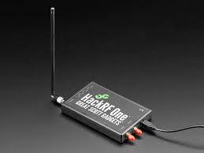

# RollJam Attack

Bienvenue dans la section **RollJam Attack**. Cette attaque cible les systèmes sans fil utilisant des **rolling codes** (codes tournants), principalement les télécommandes de portes de garage et les systèmes sans clé des voitures. L'objectif d'un **RollJam** est de capturer un code valide pour le réutiliser ultérieurement afin d'accéder à un système protégé sans l'autorisation du propriétaire.

> [!CAUTION]  
> ⚠️ **Avertissement :**  
> Les informations présentées ici sont destinées à des fins éducatives uniquement. L'utilisation malveillante de ces techniques est strictement interdite. Toute expérimentation doit se faire dans un cadre légal, avec l'autorisation des propriétaires des systèmes ciblés.

---

## Présentation de l'attaque par relais classique (sans rolling code)

### Qu'est-ce qu'une attaque par relais ?

Une **attaque par relais** est une méthode d'interception et de retransmission d'un signal sans fil légitime. Cette attaque est couramment utilisée contre des systèmes sans clé ou des télécommandes.

### Exemple avec une télécommande de porte de garage simple

Prenons une télécommande de porte de garage **sans rolling code** :
1. L'utilisateur appuie sur la télécommande pour envoyer un **code fixe** au récepteur de la porte.
2. L'attaquant capte ce code avec un appareil comme un **HackRF One**.
3. Une fois le code intercepté, l'attaquant peut le rejouer pour ouvrir la porte de garage à tout moment, car il s'agit d'un code fixe réutilisable.

### Limite des systèmes sans rolling codes

Les systèmes à **codes fixes** sont vulnérables aux attaques de replay (rejeu). Si un code est intercepté, il peut être utilisé plusieurs fois sans changement, ce qui en fait une cible facile.

---

## Présentation de la sécurité Rolling Codes

### Qu'est-ce qu'un rolling code ?

Les **rolling codes** sont une mesure de sécurité utilisée dans de nombreux systèmes sans fil modernes (comme les télécommandes de voitures ou de garages). Voici comment cela fonctionne :
1. Chaque fois que la télécommande envoie un signal, elle génère un **code unique** qui ne peut être utilisé qu'une seule fois.
2. Après chaque utilisation, à la fois la télécommande et le récepteur synchronisent un nouveau code dans une séquence préprogrammée.
3. Cela signifie qu'un code intercepté ne pourra jamais être réutilisé, ce qui empêche les attaques de replay classiques.

### Limite des rolling codes

Malgré cette sécurité, il existe une méthode pour contourner les **rolling codes** appelée **RollJam**. Cette attaque exploite la manière dont le système gère les codes non reçus ou brouillés.

---

## Explication de l'attaque RollJam

### Fonctionnement du RollJam

L'attaque **RollJam** combine une technique de **brouillage (jammer)** et d'interception pour capturer et réutiliser un code valide. Voici les étapes détaillées :

1. **Brouillage du signal** : L'attaquant utilise un brouilleur pour bloquer temporairement la transmission du signal entre la télécommande et le récepteur.
   
   - Par exemple, lorsque vous appuyez sur la télécommande pour ouvrir la porte de garage ou déverrouiller une voiture, le brouilleur empêche le récepteur (la porte ou la voiture) de recevoir ce premier signal.

2. **Capture du premier code** : Pendant que le signal est bloqué, l'attaquant capte le **premier code** généré par la télécommande à l'aide d'un appareil comme le **HackRF One**.
   
   - Ce code est valide mais n'a pas été utilisé car il n'a pas atteint le récepteur.

3. **Forcer un second code** : L'utilisateur appuie à nouveau sur la télécommande, générant un **nouveau code**.
   
   - Cette fois, l'attaquant désactive le brouilleur, et le récepteur reçoit le deuxième code, permettant à la porte de s'ouvrir ou à la voiture de se déverrouiller.

4. **Réutilisation du premier code** : L'attaquant peut ensuite utiliser le **premier code** capturé, qui est toujours valide car il n'a jamais été reçu par le récepteur.

---

## Présentation de l'outil HackRF One

### Qu'est-ce que le HackRF One ?

Le **HackRF One** est un périphérique SDR (Software Defined Radio) capable d'envoyer et de recevoir des signaux radio sur une large gamme de fréquences (de 1 MHz à 6 GHz). Il est particulièrement utile pour des tests de sécurité sans fil comme les attaques par relais ou **RollJam**.

### Caractéristiques principales :
- Gamme de fréquences : 1 MHz à 6 GHz.
- Fonctionne en demi-duplex (peut émettre et recevoir mais pas en même temps).
- Supporte des logiciels comme **GNU Radio** pour analyser et manipuler les signaux.
- Capable d'intercepter, d'enregistrer et de retransmettre des signaux radio.

### Utilisation du HackRF One pour une attaque RollJam sur une clé de voiture

#### Étapes pour capturer un signal et effectuer une attaque RollJam :

1. **Configurer le HackRF One** :
   - Installez le logiciel **GNU Radio** ou **Universal Radio Hacker (URH)**, qui permettent de visualiser et manipuler les fréquences radio captées par le HackRF.
   - Lancez le logiciel et configurez le HackRF pour écouter sur les fréquences radio des clés de voiture (généralement entre 300 MHz et 400 MHz).

2. **Scanner les fréquences** :
   - Utilisez GNU Radio ou URH pour scanner les fréquences dans la gamme des **300-400 MHz** et détecter les signaux émis par la clé de voiture sans fil lorsque le bouton est pressé.

3. **Brouillage du signal** :
   - Utilisez un script ou une fonction dans **GNU Radio** pour émettre un signal brouillant, empêchant la voiture de recevoir le code émis par la clé.

4. **Intercepter et stocker le code** :
   - Lorsque le signal est bloqué, capturez le **premier code** émis par la clé en utilisant le HackRF One. Ce code sera stocké pour être réutilisé plus tard.

5. **Relayer un nouveau code** :
   - Laissez la voiture recevoir le second code (en arrêtant le brouillage), permettant à l'utilisateur de déverrouiller le véhicule normalement.

6. **Utiliser le premier code** :
   - Vous pouvez désormais rejouer le **premier code** que vous avez capturé pour déverrouiller ou démarrer la voiture plus tard.

---

## Conclusion

L'attaque **RollJam** démontre une faiblesse dans les systèmes de sécurité sans fil utilisant des **rolling codes**, que ce soit pour les télécommandes de garage ou les systèmes de voitures sans clé. Le **HackRF One**, combiné avec des logiciels comme **GNU Radio** ou **Universal Radio Hacker (URH)**, permet d'intercepter, brouiller et rejouer ces signaux, offrant ainsi une démonstration puissante de l'importance d'une sécurité sans fil robuste.

> **Remarque :** Utilisez toujours ces techniques de manière légale et avec l'autorisation des propriétaires des systèmes.
